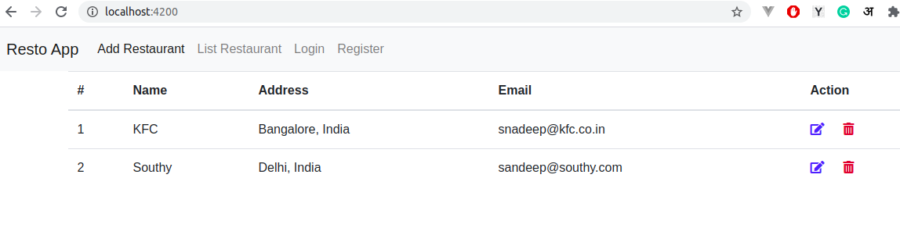
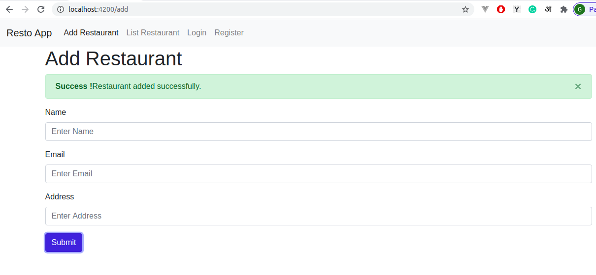

# Angular 10 Simple Project for practce
Angular 10 Simple Project for practice uses JSON-Server for API.
# 

# 

## Getting started

Install ng-cli

```
npm install -g @angular/cli
```

Create Resto Project by cloning this repo

```
git clone https://github.com/ImSandeepMishra/angular-10-simple-project.git
```
Get a full fake REST API with __zero coding__

Ref: https://github.com/typicode/json-server#getting-started

Install JSON Server 

```
npm install -g json-server
```

Create a `db.json` file with some data

```json
{
  "posts": [
    { "id": 1, "title": "json-server", "author": "typicode" }
  ],
  "comments": [
    { "id": 1, "body": "some comment", "postId": 1 }
  ],
  "profile": { "name": "typicode" }
}
```

Start JSON Server

```bash
json-server --watch db.json
```
